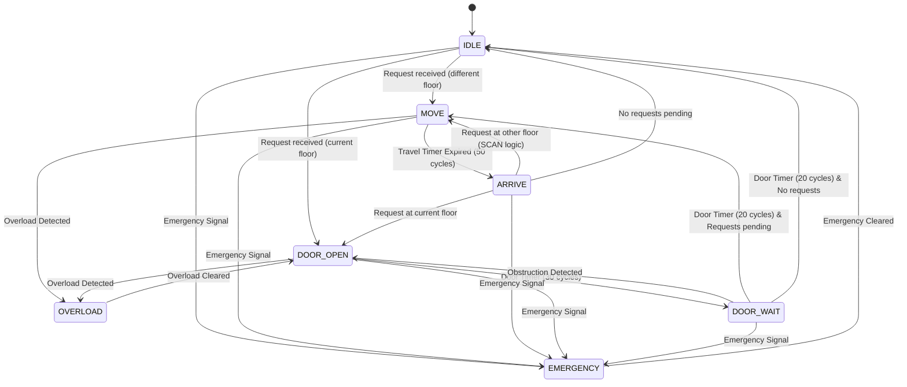

# Hardware Design Documentation

## 1. Module Overview (`smart_elevator.v`)

The core of the system is the `smart_elevator` module, written in pure Verilog HDL. It is a fully synthesizable design targeting FPGA implementation.

### Interface Definition
| Port | Direction | Bus Width | Description |
| :--- | :--- | :--- | :--- |
| `clk` | Input | 1-bit | System clock (100 MHz expected) |
| `reset` | Input | 1-bit | Asynchronous active-high reset |
| `req` | Input | 8-bit | One-hot encoded floor requests (Bit 0 = Floor 0, Bit 7 = Floor 7) |
| `emergency` | Input | 1-bit | High-priority emergency stop signal |
| `overload` | Input | 1-bit | Weight overload sensor input |
| `door_sensor` | Input | 1-bit | Door safety sensor (active high if obstructed) |
| `current_floor` | Output | 3-bit | Current floor number (0-7) |
| `direction` | Output | 1-bit | Current travel direction (1 = UP, 0 = DOWN) |
| `motor_enable` | Output | 1-bit | Motor control signal (Active High) |
| `door_open` | Output | 1-bit | Door state (1 = Open, 0 = Closed) |
| `alarm` | Output | 1-bit | Safety alarm output (Active High) |

---

## 2. Finite State Machine (FSM)

The controller uses a hierarchical 7-state FSM designed for clarity and safety.

### State Encodings (4-bit)
*   **`IDLE` (0000)**: Waiting for requests. No movement.
*   **`MOVE` (0001)**: Elevator is in motion between floors.
*   **`ARRIVE` (0010)**: Reached target floor, preparing to open doors.
*   **`DOOR_OPEN` (0011)**: Doors are fully open. Passenger transfer.
*   **`DOOR_WAIT` (0100)**: Waiting period before closing doors. Checks for obstructions.
*   **`EMERGENCY` (0101)**: Safety override. Motor stopped immediately.
*   **`OVERLOAD` (0110)**: Safety override. Prevent movement due to weight.

### State Transition Diagram

---

## 3. Detailed Logic Implementation

### Request Latching
To ensure reliability, the system latches all incoming requests asynchronously.
*   **Set Condition**: `pending_requests = pending_requests | req` (Bitwise OR with input).
*   **Clear Condition**: `pending_requests[current_floor] = 0` only when `state == DOOR_OPEN`.

### SCAN Algorithm Implementation
The direction logic is implemented in the `find_next_request` function within the Verilog code.
1.  **Check Current Direction**: Look for any requests in the current direction (e.g., if UP, check floors > current).
2.  **Continue**: If requests exist, maintain direction.
3.  **Reverse**: If no requests exist in the current direction, check the opposite direction.
4.  **Idle**: If no requests exist anywhere, default to current floor (which leads to IDLE).

### Timing Implementation
The design uses counters based on clock cycles.
*   **`FLOOR_TRAVEL_TIME` (50 cycles)**: Represents physical movement between floors.
*   **`DOOR_OPEN_TIME` (30 cycles)**: Duration doors remain fully open.
*   **`DOOR_WAIT_TIME` (20 cycles)**: Safety buffer before closing doors.

*Note: In a real FPGA implementation with a 100MHz clock, these values would need to be scaled (e.g., 50,000,000 for 0.5s). The current values are optimized for simulation speed.*

---

## 4. Safety Systems

### Emergency Stop (Priority 1)
*   Implemented as the highest priority check in the FSM combinatorial logic.
*   Overrides **all** other state transitions.
*   Immediately sets `motor_enable = 0` and `alarm = 1`.

### Overload Protection (Priority 2)
*   Checked during `MOVE` and `DOOR_OPEN` states.
*   Prevents transition out of `DOOR_OPEN` (or forces entry into `OVERLOAD` state) to stop the elevator from moving with excessive weight.
*   Activates `alarm`.

### Door Obstruction (Priority 3)
*   Monitored during `DOOR_WAIT`.
*   If `door_sensor` goes high, the FSM transitions back to `DOOR_OPEN`.
*   Resets the `door_timer`, effectively extending the door open duration until the obstruction is cleared.
